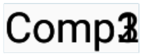
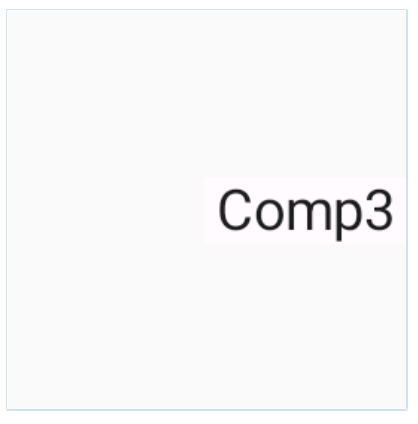

# Box

- 자식들을 스택처럼 위로 쌓아서 정렬하는 컴포저블이다.

---

예제

```Kotlin
Box {
    Text("Comp1")
    Text("Comp2")
    Text("Comp3")
}
```


<br><br>

## Box 정렬

- `contentAlignment`라는 하나의 정렬 파라미터로 자식 그룹의 위치를 커스터마이즈<br> 할 수 있다.
  <br><br>

**지정할 수 있는 값**

- Alignment.TopStart
- Alignment.TopCenter
- Alignment.TopEnd
- Alignment.CenterStart
- Alignment.Center
- Alignment.CenterEnd
- Alignment.BottomStart
- Alignment.BottomCenter
- Alignment.BottomEnd

---

예제

```Kotlin
 Box(contentAlignment = Alignment.CenterEnd,
 // 끝쪽 중간에 정렬
    modifier = Modifier.size(100.dp, 100.dp)) {
    Surface { // Surface를 이용하면 Text의 배경을 불투명하게 바꿀 수 있다.
        Text(" Comp1 ")
    }
    Surface {
        Text(" Comp2 ")
    }
    Surface {
        Text(" Comp3 ")
    }
}
```



<br>

## BoxScope 모디파이어

- `align()`: Box 콘텐츠 영역 안의 자식을 정렬한다. 지정한 Aligment값을 이용한다.
- `matchParentSize()` : 모디파이어가 적용된 자식의 크기를 부모 Box의 크기에 맞춘다. <br><br>

**지정할 수 있는 값**(Box 정렬에서 소개한 것과 동일)

- Alignment.TopStart
- Alignment.TopCenter
- Alignment.TopEnd
- Alignment.CenterStart
- Alignment.Center
- Alignment.CenterEnd
- Alignment.BottomStart
- Alignment.BottomCenter
- Alignment.BottomEnd
