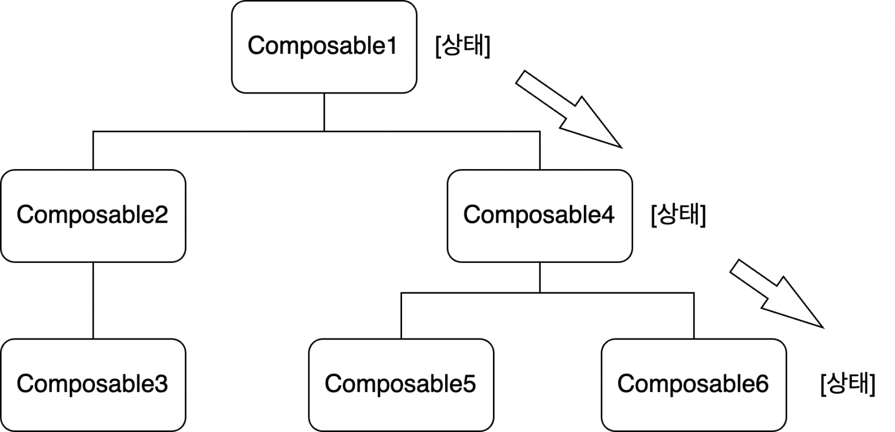
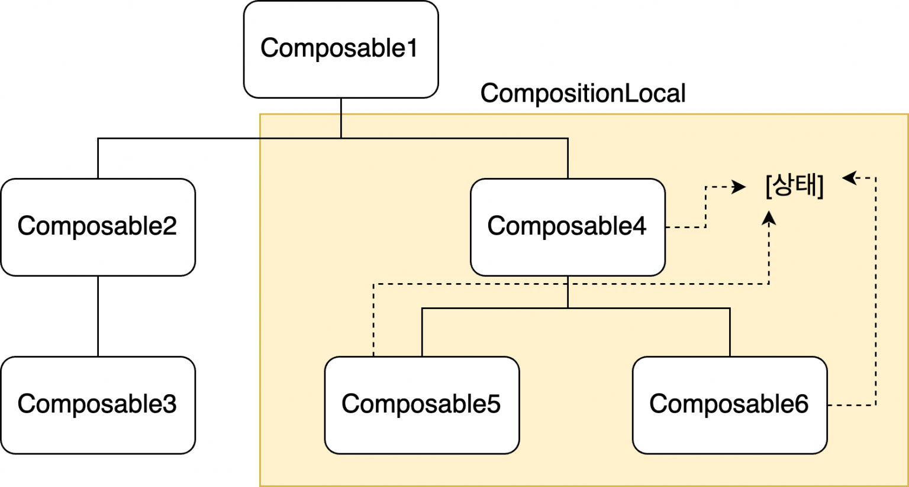

# CompositionLocal

---

- `Composable1`의 상태를 `Composable6`에게 전달하기 위해서는 
  `Composable4`에 `Composable1`의 상태를 전달할 필요가 없더라도 전달해야 한다. 
  -> 이러한 문제의 해결책이 `CompositionLocal` 이다.

---

 

### CompositionLocal?

- 중간 자식 트리에 상태를 전달하지 않고도 트리의 가장 높은 트리에 선언되어 있는  데이터를 하위 노드에서 이용할 수 있도록 해주는 것이다.
  
- `CompositionLocal` 사용시 값이 할당된 지점 아래의 트리 분기에서만 데이터를 이용할 수 있다.

---

CompositionLocal을 이용해 상태를 선언하려면`ProvidableCompositionLocal` 인스턴스를 생성해야 하는데, 이 인스턴스는 아래의 두 함수 중 하나를 호출해서 얻을 수 있다.

- `staticCompositionLocalOf() ` 
  상탯값 변경시 해당 상태가 할당되어 노드의 후위 노드를 모두 재구성해야 한다. 
  -> 자주 변경되지 않는 상탯값을 저장할 때 이용한다.
- `compositionLocalOf()` 
  현재 상태에 접근하는 컴포저블에 대해서만 재구성을 수행한다. 
  -> 변경이 잦을 상태를 다룰 때 이용한다.
