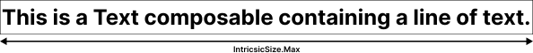
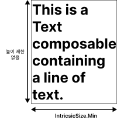
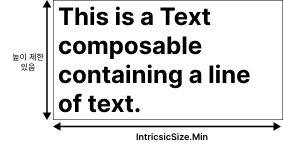

# IntrinsicSize

- 가장 큰 자식이 가질 수 있는 최댓값, 최솟값의 정보를 부모에게 제공한다.
- 부모 컴포저블은 **IntrinsicSize** 열거형의 **Min**, **Max** 값에 접근하여 그 자식의 크기 정보를 얻을 수 있다.

```Kotlin
// Row 컴포저블의 높이 설정하기
Row(modifier = modifier.height(IntrinsicSize.Min)) {

}
// Row의 높이는 가장 큰 자식을 표현할 수 있는 최소 높이로 설정된다.
```

---

```Kotlin
// Column 컴포저블의 폭 설정하기
Column(modifier = width.height(IntrinsicSize.Max)) {

}
// Column의 폭이 가장 폭이 넓은 자식의 최대 가능 폭으로 설정된다.
```

<br>

### 예제

---

한 행의 텍스트를 표시하는 Text 컴포저블의 최대 폭과 <br>
그 컴포저블이 표시하는 텍스트의 길이는 같다. <br>
-> 이것은 **IntrinsicSize**의 **Max**값과 같다.


<br><br>

높이 제한이 없다고 가정하면 Text 컴포넌트가 필요로 하는 최소 폭은 <br>
텍스트 문자열 중 가장 긴 당어의 길이와 같게 된다. <br>
-> 이것은 **IntrinsicSize**의 **Min**값과 같다. <br>


<br><br>

만약 높이 제한이 있다면 Min값은 달라지게 된다.<br>

