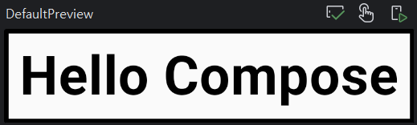
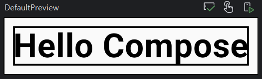

# Modifier

컴포즈 내장 객체이며, 컴포저블에 적용될 수 있는 설정을 저장한다.<br>
`Modifier`를 선언한 뒤, 다른 컴포저블에 전달하여 형태나 행동을 변경 할 수 있다.<br>
`Modifier`를 선언한 뒤에는 그 `Modifier`를 파라미터로 받는 모든 컴포저블에 전달할 수 있다.

---

**modifier로 설정할 수 있는 다양한 프로퍼티들**

- border
- padding
- background
- size
- event handler
- gesture 등등
  <br><br>

### **Modifier 만들기** <br>

다음은 적용된 모든 컴포저블에 상하좌우 10dp의 패딩을 더하고, <br>
2dp 두께의 검은색 윤곽선을 추가하는 `Modifier`이다.

```Kotlin
val modifierEx = Modifier
        .padding(all = 10.dp)
        .border(width = 2.dp, color = Color.Black)
```

---

<br>

### Modifier 이용하기

```Kotlin
@Composable
fun DemoScreen() {
    val modifier = Modifier
        .border(width = 2.dp, color = Color.Black)
        .padding(all = 10.dp)

    Text(
        "Hello Compose",
        modifier = modifier, // Modifier 사용
        fontSize = 40.sp,
        fontWeight = FontWeight.Bold
    )
}
```

---

<br>

### Modifier의 연결순서

```Kotiln
val modifier = Modifier
        .border(width = 2.dp, color = Color.Black)
        .padding(all = 10.dp)
```

 <br>
위의 코드를 아래의 코드처럼 순서를 바꾸게 된다면
<br><br>

```Kotiln
val modifier = Modifier
        .border(width = 2.dp, color = Color.Black)
        .padding(all = 10.dp)
```

 <br>
결과는 달라지게 된다.

---

<br><br>

### Modifier 조합하기

- `then()` 키워드를 이용한다.
- 결과적으로 지정된 모든 `Modifier`의 설정을 포함한 `Modifier`가 반환된다.

```Kotlin
@Composable
fun DemoScreen() {
    val modifier = Modifier
        .border(width = 2.dp, color = Color.Black)
        .padding(all = 10.dp)

    val secondModifier = Modifier.height(100.dp)

    Text(
        "Hello Compose",
        modifier.then(secondModifier) // Modifier 조합하기
        fontSize = 40.sp,
        fontWeight = FontWeight.Bold
    )
}
```
