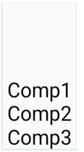

# Row / Column

### Row 컴포저블

- 자식 컴포넌트를 화면의 수평 방향으로 배열하는 컴포저블이다.

```Kotlin
Row {
    Text("Comp1")
    Text("Comp2")
    Text("Comp3")
}
```


---

<br>

### Column 컴포저블

- 자식 컴포넌트를 화면의 수직방향으로 배열하는 컴포저블이다.

```Kotlin
Column {
    Text("Comp1")
    Text("Comp2")
    Text("Comp3")
}
```


---

<br>

### Row와 Column 컴포저블 조합하기

- 다음과 같이 Column과 Row컴포저블을 조합하여 사용할 수 있다.

```Kotlin
Column {
    Row {
        Column {
            Text(" Comp1 ")
            Text(" Comp2 ")
            Text(" Comp3 ")
        }
        Column {
            Text(" Comp4 ")
            Text(" Comp5 ")
            Text(" Comp6 ")
        }
        Column {
            Text(" Comp7 ")
            Text(" Comp8 ")
            Text(" Comp9 ")
        }
    }
}
```


<br><br>

### 레이아웃 정렬

---

**수직 방향으로 정렬**

- Row 컴포저블의 verticalAlignment 파라미터에 값을 전달해서 변경할 수 있다.

---

- Alignment.Top : 콘텐츠를 Row 콘텐츠 영역의 수직방향 위에 정렬
- Alignment.CenterVertically : 콘텐츠를 Row 콘텐츠 영역의 수직방향 가운데에 정렬
- Aligment.Bottom : 콘텐츠를 Row 콘텐츠 영역의 수직 방향 아래 위치에 정렬

---

예제

```Kotlin
Row(verticalAlignment = Alignment.CenterVertically,
// Row 콘텐츠 영역의 수직 방향 중앙으로 정렬
modifier = Modifier.size(width = 180.dp, height = 50.dp)) {
    Text(" Comp1 ")
    Text(" Comp2 ")
    Text(" Comp3 ")
}
```


---

<br>

**수평 방향으로 정렬**

- Column 컴포저블의 horizontalAlignment 파라미터에 값을 전달해서 변경할 수 있다.

---

- Alignment.Start : 콘텐츠를 Column 콘텐츠 영역의 수평방향 시작 위치에 정렬
- Alignment.CenterHorizontally : 콘텐츠를 Column 콘텐츠 영역의 수평방향 가운데 위치에 정렬
- Aligment.End : Column 콘텐츠 영역의 수평방향 위치에 정렬

---

예제

```Kotlin
Column(horizontalAlignment = Alignment.CenterHorizontally,
// Column 영역의 수평방향 가운데 정렬
modifier = Modifier.size(width = 180.dp, height = 50.dp)) {
    Text(" Comp1 ")
    Text(" Comp2 ")
    Text(" Comp3 ")
}
```


---

<br>

### 레이아웃 배열 위치 조정하기

- 배열(Arrangement)은 자식의 위치를 컨테이너와 동일한 축을 따라서 제어한다.

---

<br>

Row 인스턴스에서는 `horizontalArrangement` 를 이용해서 배열값을 선언한다.

**horizontalArrangement인스턴스**

- `Arrangement.Start` : 콘텐츠를 Row 콘텐츠 영역의 수평 시작 위치에 정렬한다.
- `Arrangement.Center` : 콘텐츠를 Row 콘텐츠 영역의 수평 중간 위치에 정렬한다.
- `Arrangement.End`: 콘텐츠를 Row 콘텐츠 영역의 수평 끝 위치에 정렬한다.

---

예제

```Kotlin
Row(horizontalArrangement = Arrangement.Center,
  modifier = Modifier.height(100.dp)) {
  Text(" Comp1 ")
  Text(" Comp2 ")
  Text(" Comp3 ")
}
```

  

---

  <br>

Column 인스턴스에서는 `verticalArrangement`를 이용해서 배열값을 선언한다.

**verticalArrangement 인스턴스**

- `Arrangement.Top`: 콘텐츠를 Column 콘텐츠 영역의 수직방향 위에 정렬한다.
- `Arrangement.Center`: 콘텐츠를 Column 콘텐츠 영역의 수직방향 가운데에 정렬한다.
- `Arrangement.Bottom` : 콘텐츠를 Column 콘텐츠 영역의 수직방향 아래 위치에 정렬한다.

---

예제

```Kotlin
Column(verticalArrangement = Arrangement.Bottom,
    modifier = Modifier.size(height = 60.dp, width = 190.dp)) {
    Text(" Comp1 ")
    Text(" Comp2 ")
    Text(" Comp3 ")
}
```


