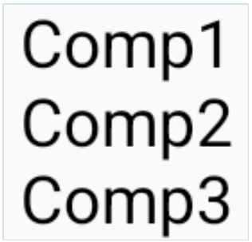

# Row / Column

## Row 컴포저블

- 자식 컴포넌트를 화면의 수평 방향으로 배열하는 컴포저블이다.

```Kotlin
Row {
    Text("Comp1")
    Text("Comp2")
    Text("Comp3")
}
```


<br>+

## Column 컴포저블

- 자식 컴포넌트를 화면의 수직방향으로 배열하는 컴포저블이다.

```Kotlin
Column {
    Text("Comp1")
    Text("Comp2")
    Text("Comp3")
}
```



<br>

## Row와 Column 컴포저블 조합하기

- 다음과 같이 Column과 Row컴포저블을 조합하여 사용할 수 있다.

```Kotlin
Column {
    Row {
        Column {
            Text(" Comp1 ")
            Text(" Comp2 ")
            Text(" Comp3 ")
        }
        Column {
            Text(" Comp4 ")
            Text(" Comp5 ")
            Text(" Comp6 ")
        }
        Column {
            Text(" Comp7 ")
            Text(" Comp8 ")
            Text(" Comp9 ")
        }
    }
}
```


<br><br>

## 레이아웃 정렬

**수직 방향으로 정렬**

- Row 컴포저블의 verticalAlignment 파라미터에 값을 전달해서 변경할 수 있다.

---

- Alignment.Top : 콘텐츠를 Row 콘텐츠 영역의 수직방향 위에 정렬
- Alignment.CenterVertically : 콘텐츠를 Row 콘텐츠 영역의 수직방향 가운데에 정렬
- Aligment.Bottom : 콘텐츠를 Row 콘텐츠 영역의 수직 방향 아래 위치에 정렬

---

예제

```Kotlin
Row(verticalAlignment = Alignment.CenterVertically,
// Row 콘텐츠 영역의 수직 방향 중앙으로 정렬
modifier = Modifier.size(width = 180.dp, height = 50.dp)) {
    Text(" Comp1 ")
    Text(" Comp2 ")
    Text(" Comp3 ")
}
```


<br>

**수평 방향으로 정렬**

- Column 컴포저블의 horizontalAlignment 파라미터에 값을 전달해서 변경할 수 있다.

---

- Alignment.Start : 콘텐츠를 Column 콘텐츠 영역의 수평방향 시작 위치에 정렬
- Alignment.CenterHorizontally : 콘텐츠를 Column 콘텐츠 영역의 수평방향 가운데 위치에 정렬
- Aligment.End : Column 콘텐츠 영역의 수평방향 위치에 정렬

---

예제

```Kotlin
Column(horizontalAlignment = Alignment.CenterHorizontally,
// Column 영역의 수평방향 가운데 정렬
modifier = Modifier.size(width = 180.dp, height = 50.dp)) {
    Text(" Comp1 ")
    Text(" Comp2 ")
    Text(" Comp3 ")
}
```


<br>

### 레이아웃 배치하기

- Arrangement는 자식의 위치를 컨테이너와 동일한 축을 따라서 제어한다.

---

<br>

Row 인스턴스에서는 `horizontalArrangement` 를 이용해서 레이아웃의 배치방식을 정한다.

**horizontalArrangement인스턴스**

- `Arrangement.Start` : 콘텐츠를 Row 콘텐츠 영역의 수평 시작 위치에 배치한다.
- `Arrangement.Center` : 콘텐츠를 Row 콘텐츠 영역의 수평 중간 위치에 배치한다.
- `Arrangement.End`: 콘텐츠를 Row 콘텐츠 영역의 수평 끝 위치에 배치한다.

---

예제

```Kotlin
Row(horizontalArrangement = Arrangement.Center,
  modifier = Modifier.height(100.dp)) {
  Text(" Comp1 ")
  Text(" Comp2 ")
  Text(" Comp3 ")
}
```

  

---

  <br>

Column 인스턴스에서는 `verticalArrangement`를 이용하여 레이아웃의 배치방식을 정한다.

**verticalArrangement 인스턴스**

- `Arrangement.Top`: 콘텐츠를 Column 콘텐츠 영역의 수직방향 위에 배치한다.
- `Arrangement.Center`: 콘텐츠를 Column 콘텐츠 영역의 수직방향 가운데에 배치한다.
- `Arrangement.Bottom` : 콘텐츠를 Column 콘텐츠 영역의 수직방향 아래 위치에 배치한다.

---

예제

```Kotlin
Column(verticalArrangement = Arrangement.Bottom,
    modifier = Modifier.size(height = 60.dp, width = 190.dp)) {
    Text(" Comp1 ")
    Text(" Comp2 ")
    Text(" Comp3 ")
}
```

<br>

**SpaceBetween, SpaceAround, SpaceEvenly**

- 컴포넌트들간의 간격을 동일하게 맞춰주는 컴포넌트이다.

---

- `SpaceBetween` : 양쪽 끝 컴포넌트와 레이아웃의 간격을 0으로 만든다.(없다.)

```Kotlin
fun SpaceTest() {
    Row(
        horizontalArrangement = Arrangement.SpaceBetween,
        modifier = Modifier
            .width(250.dp)
            .wrapContentHeight()
    ) {
        Text("Test1")
        Text("Test2")
        Text("Test3")
    }
}
```


---

<br>

- `SpaceAround` : 양쪽 끝 컴포넌트와 레이아웃의 간격을 컴포넌트들간의 간격의 절반으로 만든다.

```Kotlin
fun SpaceTest() {
    Row(
        horizontalArrangement = Arrangement.SpaceAround,
        modifier = Modifier
            .width(250.dp)
            .wrapContentHeight()
    ) {
        Text("Test1")
        Text("Test2")
        Text("Test3")
    }
}
```


---

<br>

- `SpaceEvenly` : 양쪽 끝 컴포넌트와 레이아웃의 간격을 컴포넌트들간의 간격과 같게 만든다.

```Kotlin
fun SpaceTest() {
    Row(
        horizontalArrangement = Arrangement.SpaceEvenly,
        modifier = Modifier
            .width(250.dp)
            .wrapContentHeight()
    ) {
        Text("Test1")
        Text("Test2")
        Text("Test3")
    }
}
```


<br>

## Row, Column 스코프 모디파이어

- Row스코프와 Column스코프는 추가 모디파이어 함수들을 제공한다.
- 이를 이용해 Row 또는 Column 안에 포함된 자식들의 동작이나 형태를 변경할 수 있다.
  <br><br>

### Column 스코프가 제공하는 Modifier

- `Modifier.align()` <br>
  **Alignment.CenterHorizontally**, **Aligment.Start**, **Aligment.End** 값을 이용해 <br> 자식들을 수평으로 정렬한다.
  <br><br>
- `Modifier.alignBy()` <br> 자식들과 **alignBy()** 모디파이어가 적용된 다른 형제를 수평으로 정렬한다.
  <br><br>
- `Modifier.weight()` <br>
  형제에 할당된 가중치에 따라 자식의 높이를 설정한다.

<br>

### Row 스코프가 제공하는 Modifier

- `Modifier.align()` <br>
  **Alignment.CenterHorizontally**, **Aligment.Start**, **Aligment.End** 값을 이용해 <br> 자식들을 수평으로 정렬한다.
  <br><br>
- `Modifier.alignBy()` <br> 자식들과 **alignBy()** 모디파이어가 적용된 다른 형제를 수평으로 정렬한다.
  <br><br>
- `Modifier.ByBaseline()` <br>
  자식의 베이스라인을 **alignBy()** 또는 **alignByBaseline()** 모디파이어가 이미 적용된 형제들과 정렬한다.
  <br><br>
- `Modifier.ByBaseline()` <br>
  자식의 정렬라인에 패딩을 추가한다.
  <br><br>
- `Modifier.ByBaseline()` <br>
  형제에 할당된 가중치에 따라 자식의 폭을 설정한다.

---

예제

```Kotlin
Row(modifier = Modifier.height(50.dp)) {
    Text(" Comp1 ", Modifier.align(Alignment.Top))
    Text(" Comp2 ", Modifier.align(Alignment.CenterVertically))
    Text(" Comp3 ", Modifier.align(Alignment.Bottom))
}
```


<br><br>

## 스코프 가중치 모디파이어(weight modifier)

### Row 스코프 모디파이어

- 각 자식의 폭을 그 형제들을 기준으로 상대적으로 지정할 수 있다.
- 각 자식에게 가중치 비율(0.0 ~ 1.0)을 할당한다.
- 가중치 모디파이어가 적용되지 않은 형제 요소들을 원하는 크기로 표시되고,<br> 적용된 자식들이 나머지 공간을 공유하게 된다.

---

예제

```Kotlin
Row {
        TextCell("1", Modifier.weight(weight = 0.2f, fill = true))
        TextCell("2", Modifier.weight(weight = 0.3f, fill = true))
        TextCell("3", Modifier.weight(weight = 0.4f, fill = true))
    }
```

 <br>_참고 사진_

---

<br>

### ColumnScope 모디파이어

- ColumnScope도 `align()`, `alignBy()`, `weight()` 모디파이어를 제공하고,
  수평축에서 동작한다.
