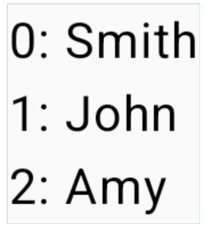

# 리스트

- 수많은 아이템을 스크롤 해야 하는 상황에 이용한다.
- 리스트의 각 아이템은 하나의 컴포저블로 나타나고 <br> 이 컴포저블들은 하위 컴포저블을 포함할 수 있다.
- Row, Column 컴포넌트를 이용해 리스트를 만들면, 화면에 표시되는 아이템의 수와 관계 없이 초기화 시점에 리스트가 포함된 모든 아이템을 만든다. <br>
  -> 리스트의 크기가 작다면 문제가 없지만 아이템의 수가 많다면 문제가 될 수 있다. <br>
  -> 길이가 긴 리스트를 다룰 때는 **LazyColumn**, **LazyRow**, **LazyVerticalGtid**를 이용한다. <br>
  -> 이 컴포넌트들은 사용자에게 보이는 아이템만 만들기 때문에 <br>
  잠재적으로 무한한 길이의 리스트도 성능 저하 없이 구현할 수 있다.

<br>

### Column, Row를 이용해 리스트 만들기

```Kotlin
// 수직 리스트 만들기
Column {
	repeat(100) {
		MyListItem()
	}
}
```

```Kotlin
// 수평 리스트 만들기
Row {
	repeat(100) {
		MyListItem()
	}
}
```

- 여기서 **MyListItem()** 컴포저블은 단일 Text 컴포저블이나 <br>
  여러 컴포저블을 포함하는 복잡한 레이아웃 등등 어떤 것이든 될 수 있다.
  <br><br>

### 지연 리스트 만들기

- **LazyColumn, LazyRow** 컴포저블을 이용해 만든다.
- **LazyListScope** 블록안에 배치한다.
- **LazyListScope** 블록이 제공하는 추가 피처를 이용해
  리스트 아이템들을 관리, 커스텀 할 수 있다.

---

예제 <br><br>
**LazyListScope**가 제공하는 함수들 <br>
<br>
`item()`함수를 호출하면 지연리스트에 개별아이템을 추가할 수 있다.

```Kotlin
LazyColumn {
    item {
        MyListItem()
    }
}
```

<br>

`items()`함수를 호출하면 여러 아이템을 한번에 호출할 수 있다.

```Kotlin
LazyColumn {
    items(1000) {
        MyListItem()
    }
}
```

<br>

`itemsIndexed()`함수를 이용하여 아이템의 콘텐츠, 인덱스 값을 함께 얻을 수 있다.

```Kotlin
val nameList = listOf("Smith", "John", "Amy")

LazyColumn {
    itemsIndexed(nameList) { index, item ->
        Text("$index: $item")
    }
}
```


